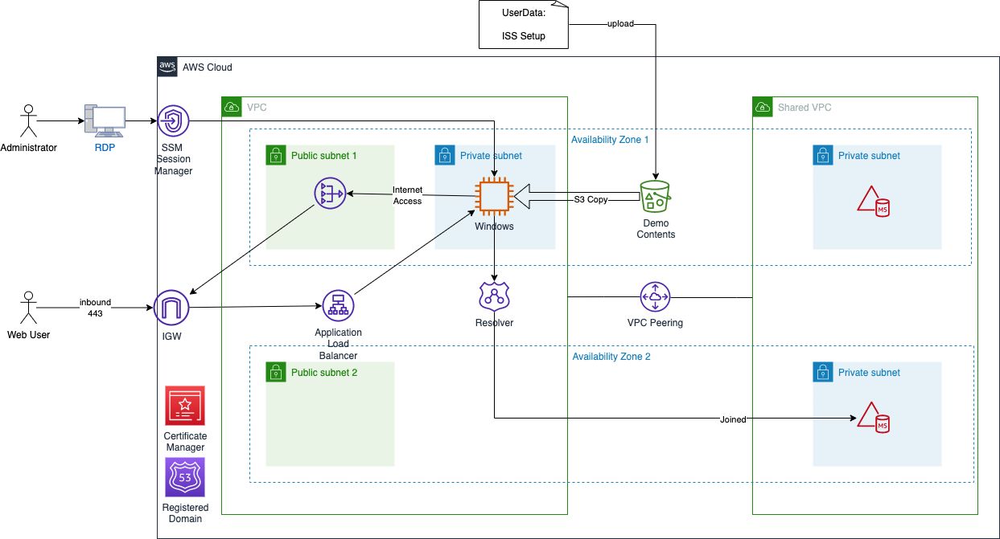

# Fujifilm Digital Pathology Demo 

> **Note**<br>
> The sample code, software libraries and templates; or other related technology (including any of the foregoing that are provided by our personnel) is provided to you as AWS Content under the AWS Customer Agreement, or the relevant written agreement between you and AWS (whichever applies). <br> 
You should **not** use this AWS Content in your production accounts, or on production or other critical data. You are responsible for testing, securing, and optimizing the AWS Content, such as sample code, as appropriate for production grade use based on your specific quality control practices and standards. <br>
Deploying AWS Content may incur AWS charges for creating or using AWS chargeable resources, such as running Amazon EC2 instances or using Amazon S3 storage.

---
© 2023 Amazon Web Services, Inc. or its affiliates. All Rights Reserved.

This AWS Content is provided subject to the terms of the AWS Customer Agreement
available at http://aws.amazon.com/agreement or other written agreement between
Customer and either Amazon Web Services, Inc. or Amazon Web Services EMEA SARL or both.

---

## 1. Description
The templates and script in this repository enable the demo deployment of a Digital Pathology environment via CloudFormation. 

Please refer to the architecture diagram below for an overview of the environment:




## 2. Prerequisites

### 2.1 Certificate in AWS Certificate Manager and Registered Domain
The following instructions will help you create or import a certificate and set up a public domain using Amazon Route 53 if required.
https://docs.aws.amazon.com/acm/latest/userguide/setup.html

### 2.2 An SSH key available for use with the windows instance
Follow the instructions below to create an SSH key in the region where the template will be deployed.
https://docs.aws.amazon.com/AWSEC2/latest/UserGuide/create-key-pairs.html


## 3. How to use the CloudFormation templates

### Step-by-step instructions

1. Clone the repository to your local directory. 
2. Set up the underlying networking and directory services using the cloudformation template `templates/DPath_VPCs.yaml`. Customise the input parameters as necessary.
3. Once the template has been deployed, upload the file `userdata/webserver.txt` to the s3 bucket created by the template in point 2. This will provice with the networking and directory service required to set up all subsequent demo systems.
4. Deploy the demo application stack `templates/DPath_Demo_App.yaml` filling out the required parameters.
5. After the final template is deployed, you should be able to see the test web server through the URI you've selected.

## 4. Connect to Instance using SSM port forwarding

### 4.1 Install Session Manager Plug-in
https://docs.aws.amazon.com/systems-manager/latest/userguide/session-manager-working-with-install-plugin.html

### 4.2 Connect using AWS CLI
```
aws ssm start-session \
--target i-07a8a7ef52e6de8e3 \
--document-name AWS-StartPortForwardingSession \
--parameters "portNumber=3389, localPortNumber=13389"
```

### 4.3 RDP to Server
Connect using RDP client to 'localhost:13389'

## 5. License
Apache License, Version 2.0, January 2004, http://www.apache.org/licenses/

## 6. Roadmap
This is a work in progress and will be updated in the coming weeks with further enhancements.